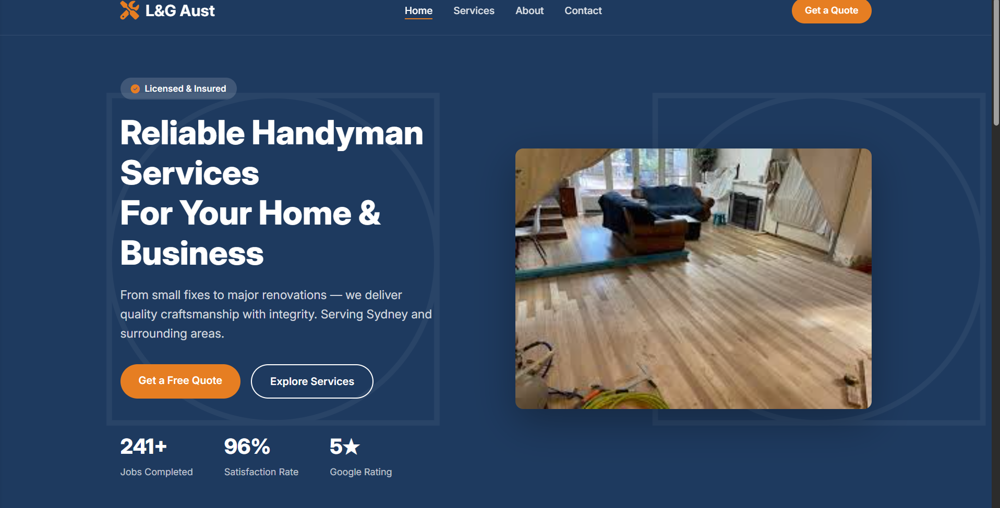

# Handymanwebsite

This is a static website I made for my parents company
Used firebase as well as github pages to host it, as firebase as a better domain (.web.app)
Asked AI for generic css class names, as I wanted this to be professional
Also asked AI for how professional websites structure their html, as again, this website is supposed to be professional
I didn't put the actual contact details for this, as I don't wanna get doxed.
Right now it doens't have mobile support. May look into that for the future
Used template images as well, as I again, don't wanna get doxed

Screenshots:

